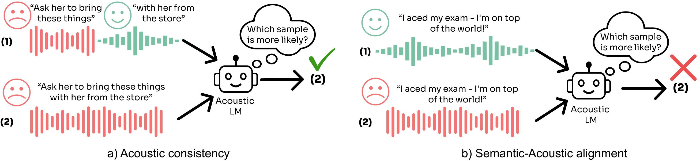

# :sushi:SALMon: Suite for Acoustic Language Model evaluation :sushi:
This repostory contatins the offical code both for evaluting your model using SALMon, and for reproducing SALMon.

<p align="center">
<a href='https://arxiv.org'></a>
   <a href='https://pages.cs.huji.ac.il/adiyoss-lab/salmon/'></a> 

</p>



## Run SALMon
### Installation
Clone the repository
```bash
git clone https://github.com/slp-rl/salmon.git
```
Our benchmark is published in [google drive](https://drive.google.com/drive/folders/1RztYzG0PeekaRV_KEuCX6Y6qT96XtUft?usp=share_link).

```bash
cd salmon
# This might require installing gdown, see - https://github.com/wkentaro/gdown?tab=readme-ov-file#installation
# You may also choose to manually download the files from the link above if you prefer
gdown 1RcXvwBZZvOaD8SjGuZn2VIhai7N0x0qL
unzip -q salmon_benchmark.zip
```

### Requirements
The only dependencies you need are `torch` and `torchaudio`.

### Evaluate Your Own Model
All you need to do in order to run SALMon on your SLM is to inherit from `InferenceModel` and implement the abstract methods.
```python
class InferenceModel(ABC):

    @abstractmethod
    def log_likelihood(self, wavs: List[torch.Tensor]) -> torch.Tensor:
        ...

    @abstractmethod
    def to(self, device):
        ...
```

When your model is ready, don't forget to add it also in `InferenceModelFactory` inside `baselines/inference.py` and a config file in `baselines/configs/inference`. There are many examples provided.

### Run!
After implementing both abstract methods and downloading the data, you can just run `salmon.py` and check your model's acoustic perception!

```bash
python salmon.py -c MODEL_CONFIG_PATH -s SALMON_FOLDER_PATH -p all
```

An example for running TWIST as reported in the paper is:
```bash
python salmon.py -c MODEL_CONFIG_PATH -s SALMON_FOLDER_PATH -p all
```

## Leaderbord

|      Method      | Sentiment Consistency | Speaker Consistency | Gender Consistency | Background Consistency (In-Domain) | Background Consistency (Random) | Room Consistency | Sentiment Alignment | Background Alignment |
|:----------------:|:---------------------:|:-------------------:|:------------------:|:----------------------------------:|:-------------------------------:|:----------------:|:-------------------:|:--------------------:|
|     Twist 7B     |         61.5          |        71.0         |        70.0        |                55.0                |              60.5               |       62.0       |        51.5         |         54.0         | 
|      pGSLM       |         40.5          |        82.5         |        88.5        |                57.5                |              66.0               |       53.5       |        55.5         |         53.0         | 
|    LAST 1.3B     | 65.0 |        64.6         |        68.5        |                56.0                |              61.0               |       62.5       |        53.5         |         52.5         | 
| Human Evaluation | 97.2 |        91.2         |        98.6        |                83.1                |              88.7               |       94.4       |        93.3         |         95.7         | 

## Generate SALMon Dataset
We provide the code and data to reproduce SALMon, or alternitavely create more samles for futher evaluation or training! 
For more instructions look at the [data_generation](data_generation) folder.


## Citation

```bibtex
@article{
    soon
}
```
