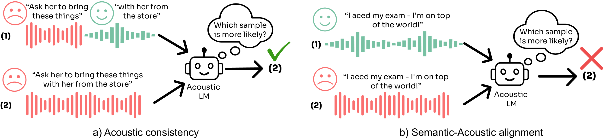

# :sushi:SALMon: Suite for Acoustic Language Model evaluation :sushi:
This repostory contatins the offical code both for evaluting your model using SALMon, and for generating SALMon data - as described in the paper "[A Suite for Acoustic Language Model Evaluation](https://arxiv.org/abs/2409.07437)" (ICASSP 2025 - Oral).


<p align="center">
    🌐 <a href="https://pages.cs.huji.ac.il/adiyoss-lab/salmon/" target="_blank">Project</a> | 📃 <a href="https://arxiv.org/abs/2409.07437" target="_blank">Paper</a> | 🤗 <a href="https://huggingface.co/datasets/slprl/SALMon" target="_blank">Dataset</a> | 💾 <a href="https://drive.google.com/drive/folders/1pVv6iMmP_VXH6Goxwnmpy-5h3jPAoJ0t?usp=share_link" target="_blank">Dataset (Drive) </a><br>
</p>




## Run SALMon
### Installation
Clone the repository
```bash
git clone https://github.com/slp-rl/salmon.git
```
Our benchmark is published in google drive - ([unzipped](https://drive.google.com/drive/folders/1pVv6iMmP_VXH6Goxwnmpy-5h3jPAoJ0t?usp=share_link), [zipped](https://drive.google.com/file/d/11qXvKtrGDVSALWDVjLi7gDBd9SkDXy10/view?usp=share_link)), and in 🤗[HuggingFace Datasets](https://huggingface.co/datasets/slprl/SALMon). The dataset will automatically be downloaded from Huggingface if a dataset path isn't provided as an argument.

```bash
cd salmon
# Downloading from drive - if you prefer, skip this phase and it will download automatically from HF
# This might require installing gdown, see - https://github.com/wkentaro/gdown?tab=readme-ov-file#installation
# You may also choose to manually download the files from the link above if you prefer
gdown 11qXvKtrGDVSALWDVjLi7gDBd9SkDXy10
unzip -q salmon_benchmark.zip
rm salmon_benchmark.zip  # cleanup
```

### Requirements
The only dependencies you need for running the benchmark are `torch` and `torchaudio`. Using the Huggingface🤗 dataset, also requires installing `datasets`. Specific baselines may require additional installations (such as textlesslib). The code was developed and tested with `python==3.10`, but should work with other, recent versions. 

### Evaluate Your Own Model
All you need to do in order to evaluate your SLM on SALMon is to inherit from `InferenceModel` and implement the abstract methods.
```python
class InferenceModel(ABC):

    @abstractmethod
    def log_likelihood(self, wavs: List[torch.Tensor]) -> torch.Tensor:
        ...

    @abstractmethod
    def to(self, device):
        ...
```

When your model is ready, don't forget to also add it in `InferenceModelFactory` inside `baselines/inference.py` and a config file in `baselines/configs/inference`. There are many examples provided.

### Run!
After implementing both abstract methods and downloading the data, you can just run `salmon.py` and check your model's acoustic perception!

```bash
python salmon.py -c MODEL_CONFIG_PATH -s SALMON_FOLDER_PATH -p all
```

We provide an example for running a random model (without further requirements) or TWIST (with additional requirements) as reported in the paper:
```bash
python salmon.py baselines/configs/inference/random.json -s salmon_benchmark -p all  # Random dummy model
python salmon.py baselines/configs/inference/TWIST-350M.json -s salmon_benchmark -p all  # TWIST 350M

```

## Leaderbord
We provide here a short version of the leaderboard for a live sortable version see the [project page](https://pages.cs.huji.ac.il/adiyoss-lab/salmon/) or [Papers with code](https://paperswithcode.com/sota/language-modelling-on-salmon).

|      Method      | Sentiment Consistency | Speaker Consistency | Gender Consistency | Background Consistency (In-Domain) | Background Consistency (Random) | Room Consistency | Sentiment Alignment | Background Alignment |
|:----------------:|:---------------------:|:-------------------:|:------------------:|:----------------------------------:|:-------------------------------:|:----------------:|:-------------------:|:--------------------:|
|     SpiritLM 7B   |         54.5          |        69.5         |        67.0        |                53.5                |              55.5               |       54.5       |        48.0         |         51.5         | 
|SpiritLM 7B (Expr.) |         73.5         |        81.0         |        85.0        |                55.0                |              64.0               |       55.5       |        52.0         |         59.5         |
|     Twist 7B     |         61.5          |        71.0         |        70.0        |                55.0                |              60.5               |       62.0       |        51.5         |         54.5         | 
|      pGSLM       |         40.5          |        83.0         |        88.5        |                57.0                |              66.0               |       53.5       |        55.5         |         53.5         | 
|    LAST 1.3B     | 65.0 |        64.5         |        68.5        |                56.0                |              61.0               |       62.5       |        53.5         |         53.0         | 
| Human Evaluation | **<ins>97.2</ins>** |  **<ins>91.2</ins>**  |  **<ins>98.6</ins>**  |  **<ins>83.1</ins>**  |  **<ins>88.7</ins>** |  **<ins>94.4</ins>** |  **<ins>93.3</ins>** |  **<ins>95.7</ins>** | 

## Generate SALMon Dataset
We provide the code and data to reproduce SALMon, or alternitavely create more samples for futher evaluation or training! 
For more instructions look at the [data_generation](data_generation) folder.

## License
We license the SALMon dataset with [cc-by-nc 4.0](https://creativecommons.org/licenses/by-nc/4.0/) as this is the license of some of the datasets used.

## Citation

```bibtex
@INPROCEEDINGS{maimon2025salmon,
  author={Maimon, Gallil and Roth, Amit and Adi, Yossi},
  booktitle={ICASSP 2025 - 2025 IEEE International Conference on Acoustics, Speech and Signal Processing (ICASSP)}, 
  title={Salmon: A Suite for Acoustic Language Model Evaluation}, 
  year={2025},
  volume={},
  number={},
  pages={1-5},
  keywords={Measurement;Codes;Publishing;Computational modeling;Pipelines;Benchmark testing;Signal processing;Acoustics;Background noise;Speech processing;Speech Language Models;Acoustic Modelling},
  doi={10.1109/ICASSP49660.2025.10888561}}

```
